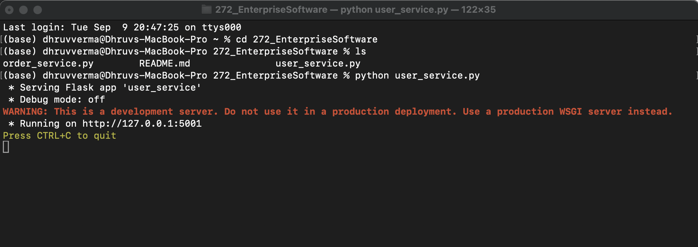
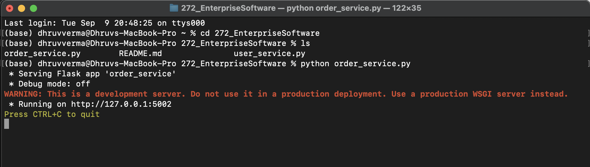
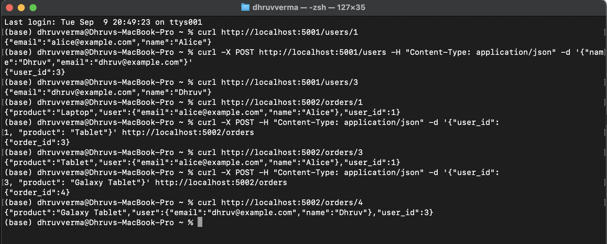
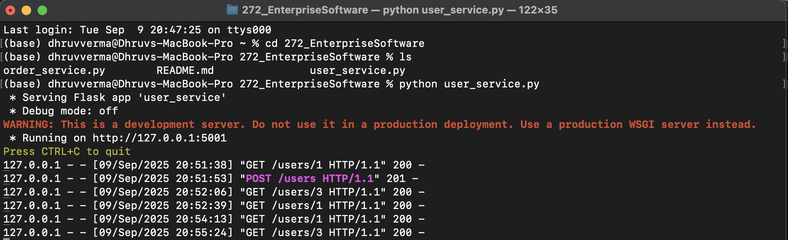
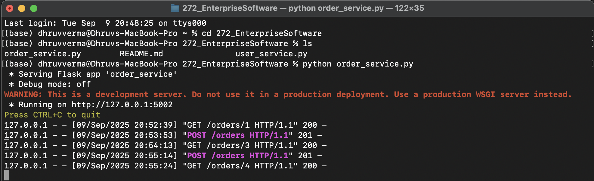

# Microservices Architecture – User & Order Services (Flask)

This project demonstrates a tiny **microservices** setup with two independent Flask apps:
- **User Service** (users Create/Read) on port **5001**
- **Order Service** (orders) on port **5002**, which **calls the User Service** to enrich order responses with user details.

The assignment provided the base code for both services. (Microservices architecture assignment.pdf) 

---

## Table of Contents
- [Overview](#overview)
- [Services](#services)
- [Environment Setup](#environment-setup)
- [Run Locally - Refer screenshots](#run-locally)
- [API Endpoints](#api-endpoints)
- [Test Walkthrough (cURL) - Refer screenshots](#test-walkthrough-curl)
- [Screenshots - Logs](#screenshots)
- [Findings & Learnings](#findings--learnings)

---

## Overview

- **User Service** exposes REST endpoints to create and fetch users. Data is kept in an **in-memory dictionary**. 
- **Order Service** exposes endpoints to create and fetch orders. Each order stores only a `user_id` and `product`. When you GET an order, the service **calls the User Service** to fetch the corresponding user and attaches it to the response.  
This matches the assignment’s reference implementations. 

---

## Services

### User Service
- **URL:** `http://localhost:5001`
- **Responsibilities:** Create a user, Get a user by ID
- **Storage:** In-memory dictionary with initial users (Alice=1, Bob=2) 

### Order Service
- **URL:** `http://localhost:5002`
- **Responsibilities:** Create an order, Get an order by ID
- **Behavior on GET:** Looks up the order locally, then calls the User Service to fetch user details and includes them in the response. 

---

## Environment Setup 

Uses a virtual environment and installs dependencies as provided in the assignment document:
```bash
python -m venv myenv
source myenv/bin/activate        # macOS/Linux
# myenv\Scripts\activate         # Windows PowerShell
pip install flask
pip install requests
```

---

## Run Locally

Open **two terminals** (same virtualenv in both).

**Terminal A — User Service**
```bash
python user_service.py
# Serving on http://127.0.0.1:5001
```

  
*User Service started successfully on port 5001*  

**Terminal B — Order Service**
```bash
python order_service.py
# Serving on http://127.0.0.1:5002
```

  
*Order Service started successfully on port 5002*  

We will also be able to see logs for each request in the corresponding terminal.

---

## API Endpoints

### User Service (port 5001)
| Method | Path             | Body (JSON)                             | Response                        |
|-------:|------------------|-----------------------------------------|----------------------------------|
| GET    | `/users/<id>`    | —                                       | `200 {"name","email"}` or `404` |
| POST   | `/users`         | `{"name": "<str>", "email": "<str>"}`   | `201 {"user_id": <int>}`        |

### Order Service (port 5002)
| Method | Path              | Body (JSON)                               | Response                                                        |
|-------:|-------------------|-------------------------------------------|------------------------------------------------------------------|
| GET    | `/orders/<id>`    | —                                         | `200 {"user_id","product","user":{...}}` or `404`               |
| POST   | `/orders`         | `{"user_id": <int>, "product": "<str>"}`  | `201 {"order_id": <int>}`                                       |

Endpoints and behavior follow the assignment’s code. 

---

## Test Walkthrough (cURL)

> Assumes both services are running as above.

1) **Get a User (Alice)**
```bash
curl http://localhost:5001/users/1
```
**Expected**
```json
{"name":"Alice","email":"alice@example.com"}
```

2) **Create a User (Corrected command)** ✅
```bash
curl -X POST http://localhost:5001/users   -H "Content-Type: application/json"   -d '{"name":"Dhruv","email":"dhruv@example.com"}'
```
**Expected**
```json
{"user_id":3}
```

3) **Get the new User**
```bash
curl http://localhost:5001/users/3
```
**Expected**
```json
{"name":"Dhruv","email":"dhruv@example.com"}
```

4) **Get an existing Order (1)** — will include Alice’s details
```bash
curl http://localhost:5002/orders/1
```
**Expected**
```json
{"user_id":1,"product":"Laptop","user":{"name":"Alice","email":"alice@example.com"}}
```

5) **Create a new Order for user 1**
```bash
curl -X POST -H "Content-Type: application/json"   -d '{"user_id": 1, "product": "Tablet"}'   http://localhost:5002/orders
```
**Expected**
```json
{"order_id":3}
```

6) **Get the newly created Order (3)** — includes Alice’s details
```bash
curl http://localhost:5002/orders/3
```
**Expected**
```json
{"user_id":1,"product":"Tablet","user":{"name":"Alice","email":"alice@example.com"}}
```

7) **Get Order 1 again**
```bash
curl http://localhost:5002/orders/1
```
**Expected**
```json
{"user_id":1,"product":"Laptop","user":{"name":"Alice","email":"alice@example.com"}}
```

  
*Example curl requests and their actual responses*  

---

## Screenshots 

  
*Logs from the User Service*  

  
*Logs from the Order Service*  

---

## Findings & Learnings

- **Service boundaries:** User data and Order data live in separate services. The Order Service **does not** own user details, it looks them up via HTTP when needed.
- **Ports & endpoints:** User Service on **5001** with `GET /users/<id>` and `POST /users`, Order Service on **5002** with `GET /orders/<id>` and `POST /orders`.
- **State is ephemeral:** Both services keep data in memory.
- **Assignment Findings:** The example command under *“Example Requests”* listed **“Create a User: curl http://localhost:5001/users/1”**, which is actually the path for GET. The correct **Create User** command is:  
  ```bash
  curl -X POST http://localhost:5001/users -H "Content-Type: application/json" -d '{"name":"Dhruv","email":"dhruv@example.com"}'
  ```
  
---

### Credits
- Base code and description adapted from the provided assignment PDF. (Microservices architecture assignment.pdf)
